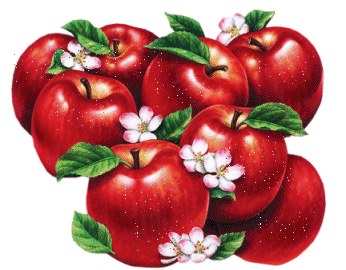

# Divide the apples

n schoolchildren divide k apples evenly, the residue remains in the basket. How many apples will get each child?

### Input
Two positive integers n and k, not greater than 1500 - rarely happens in school more pupils, and too many apples to eat bad ...

### Output
Print the number of apples that goes to each child.
