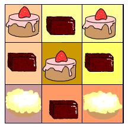

# Tuck-shop

In the school cafeteria to the end of lessons there were some cakes: a vanilla, b chocolate and c fruit. Dima is going to buy cakes before closing the buffet. What is the maximum possible number of cakes can choose Dima?

### Input
In a single line given three non-negative integers - the appropriate amount of cakes, each of which does not exceed 20000.

### Output
Print the maximum possible number of cakes that Dima can choose.